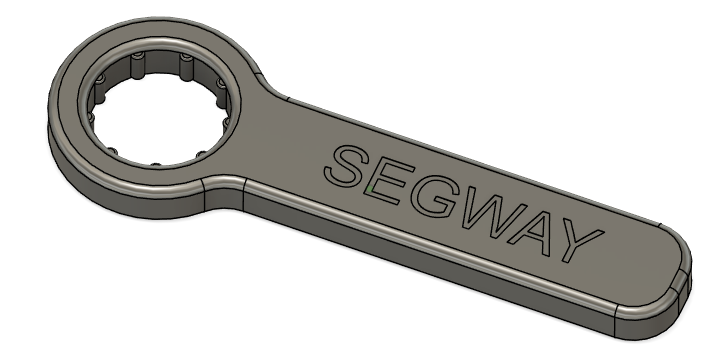

**3D‑Printed Segway i2/X2 Adjustment Wrench**

A simple wrench to adjust the post lenght on a Segway i2/X2.

**Parts needed:**

* ABS/ASA Filament

**Print Orientation & Color**

1. Place the model on the build plate with the logo facing down (logo towards the bed).
2. Adjust the “Color/Paint Height” (or equivalent setting) to change the logo’s color.
3. The logo is sunken 0.2  mm above the surrounding surface, so you will need to print a different color in that space to create the contrast.
   
With these settings the wrench will fit snugly and can be kept in the saddle bags.

File under (media/Segway-Wrench.stl)

